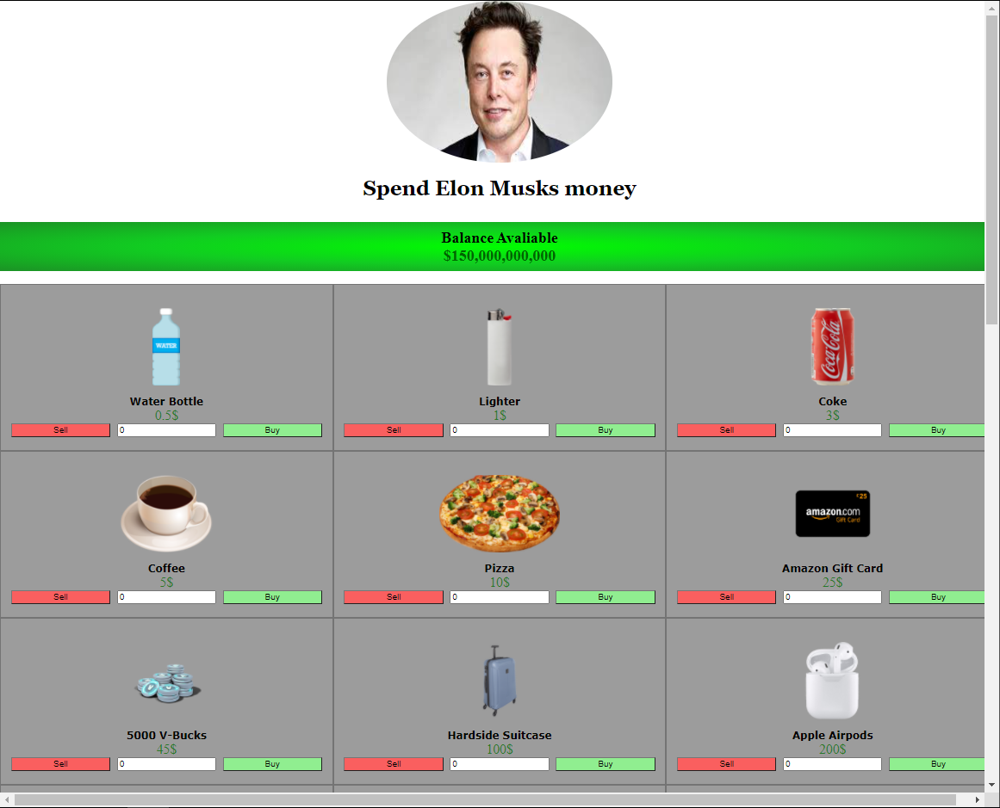

# Spend Elon Musks Money
## Assignment for infomatik April 2021 

Made by Emil, Hector og Johannes

### Setup

- Install [git-bash](https://git-scm.com/downloads)
- Clone this repository with git-bash with this command:
```
git clone https://github.com/johannes67890/Spend-Elon-Musks-Money.git
```
###### You can also download the repository directly from github as a .zip

- Open then the HTML file in the downloaded directory: ```../src/ui/index.html```

#### Please open the HTML file in Google chrome for alert feature and more!

[Link to Google Docs](https://docs.google.com/document/d/1gDWuoMCSmeoFAbLCFk8Rvg7lYigrCp7-lk3ZK6oRXlU/edit?usp=sharing)
